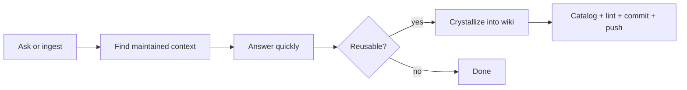

# vipin wiki

A source-backed knowledge system with multi-agent orchestration. Turns research, conversations, and automation into maintained, interlinked Markdown knowledge that compounds over time.

## Architecture

```
┌──────────────────────────────────────────────────────────────────┐
│                         vipin wiki                                │
├──────────────┬───────────────┬──────────────┬───────────────────┤
│  wiki/       │  raw/         │  scripts/    │  site/            │
│  Knowledge   │  Immutable    │  Tooling     │  Quartz           │
│  graph       │  sources      │              │  publisher        │
├──────────────┴───────────────┴──────────────┴───────────────────┤
│                    Agent Hub (D:\devtools\agent-hub)              │
│  20 MCP tools · real-time daemon · shared state · auto-dispatch  │
├──────────────────────────────────────────────────────────────────┤
│  Opus 4.7  │  GPT-5.5  │  Sonnet 4.6  │  Haiku 4.5  │  DS Pro │
│  Architect  │  Fast exec │  Reviewer    │  Speedster  │  Bulk   │
└──────────────────────────────────────────────────────────────────┘
```

## Quick Start

| You are | Do this |
|---------|---------|
| The user | Open Codex. Everything else is automatic. |
| A future agent | Read `AGENTS.md` → `CLAUDE.md` → `wiki/index.md` |
| A maintainer | `python scripts/wiki-catalog.py --root .` then `git push` |

## Repository Map

```
.
├── AGENTS.md              # Authoritative operating contract (all agents read this)
├── CLAUDE.md              # Claude Code entry point
├── purpose.md             # Research direction alignment
├── wiki/                  # Public maintained knowledge graph
│   ├── index.md           # Human-readable catalog
│   ├── log.md             # Chronological activity log
│   ├── entities/          # People, orgs, projects
│   ├── concepts/          # Frameworks, workflows, rules
│   ├── sources/           # One page per ingested source
│   ├── analyses/          # Syntheses and comparisons
│   ├── queries/           # Preserved Q&A
│   └── topics/            # High-frequency corpus hubs
├── wiki-private/          # Local-only (never in public Git)
├── raw/                   # Immutable source materials
├── scripts/               # Catalog, lint, search, build utilities
├── site/                  # Quartz publishing adapter
├── .codex/skills/         # 38 Codex skills
├── .claude/skills/        # Claude Code skills (lidang-perspective, mattpocock-skills)
└── .github/workflows/     # CI: deploy Quartz + health check
```

## Multi-Agent System

Five agents collaborate via the Agent Hub MCP server with automatic orchestration:

| Agent | Model | Role | Best at |
|-------|-------|------|---------|
| **Opus** | Claude 4.7 | Architect | Complex refactors, 1M context, architecture, security |
| **GPT-5.5** | GPT-5.5 | Coordinator | Speed, task decomposition, parallel subagents, wiki |
| **Sonnet** | Claude 4.6 | Reviewer | Code review, test suggestions, documentation |
| **Haiku** | Claude 4.5 | Speedster | Lint, formatting, pre-screening, classification |
| **DeepSeek** | V4 Pro | Bulk worker | Translation, summarization, Chinese content |

Key capabilities:
- **Real-time dispatch** — daemon auto-routes urgent messages to the right agent
- **Auto-retry cascade** — Opus → Sonnet → DeepSeek on failure
- **Quality gate** — Haiku lint (2s) → Sonnet review (10s) → PASS/FAIL
- **Pipeline with gates** — sequential workflows with human confirmation at critical steps
- **Warm context** — project state auto-cached every 5 min, agents start informed
- **20 MCP tools** — messaging, shared state, threads, routing, metrics, direct invocation

Infrastructure starts on boot. User only opens one chat window.

## Core Loop



## Commands

```powershell
.\scripts\wiki-catalog.ps1          # Rebuild catalog.json
.\scripts\wiki-lint.ps1             # Check links, leaks, orphans
.\scripts\wiki-search.ps1 "query"   # Full-text search
.\scripts\wiki-status.ps1           # Repository health
.\scripts\build-site.ps1            # Quartz build
```

```bash
python scripts/wiki-catalog.py --root .
python scripts/wiki-search.py "query" --root .
```

## Quality Discipline

- Public/private boundary enforced — `wiki-private/` never leaks
- Source attribution preserved — EXTRACTED / INFERRED / AMBIGUOUS / UNVERIFIED
- No append-only accumulation — merge, rewrite, or propose deletion when needed
- Scoped commits only — stage what belongs to the current task
- Catalog must be fresh before push — CI validates this

## CI/CD

| Workflow | Trigger | What it does |
|----------|---------|--------------|
| `deploy.yml` | Push to `wiki/**` or `site/**` | Validate catalog + lint → build Quartz → deploy to GitHub Pages |
| `pages-health.yml` | Daily 04:17 UTC | Verify live site serves Quartz wiki (not README) |

Published site: [appleweiping.github.io/vipin-wiki](https://appleweiping.github.io/vipin-wiki/)

## For Agents

Read `AGENTS.md`. It defines:
- Mission and operating priority
- Wiki structure and page conventions
- Source handling and sensitivity rules
- Multi-agent collaboration model with Agent Hub
- Commit policy and quality gates
- Research ideation policy

Changes to infrastructure must update: `CLAUDE.md`, `AGENTS.md`, `README.md`, `.claude/skills/README-skills-layout.md`, and `D:\devtools\agent-hub\README.md`.
