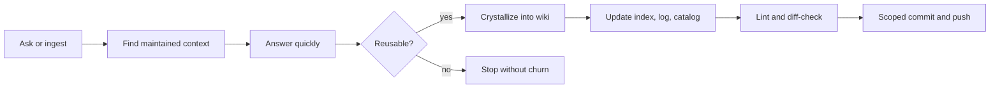

# vipin wiki

`vipin wiki` is a source-backed knowledge system for research memory, project history, and reusable agent workflows.

It turns important sources, local project discoveries, conversations, and automation results into maintained Markdown knowledge. The point is not to collect more files; the point is to make future answers faster, safer, and better grounded.

## Start Here

| You are | First move | Then use |
| --- | --- | --- |
| A reader | Open `wiki/index.md` | Follow topic, source, entity, and analysis links |
| A future agent | Read `AGENTS.md`, `.wiki-schema.md`, `purpose.md` | Check `wiki/catalog.json`, recent `wiki/log.md`, then inspect only relevant pages |
| A maintainer | Run the status, catalog, and lint commands below | Commit and push scoped, validated changes |
| A publisher | Treat `wiki/` as the source of truth | Use `site/` only as the Quartz publishing adapter |

## What It Is

- A public Markdown wiki for durable, publishable knowledge.
- A private local layer for sensitive material that must never leak into public pages, indexes, logs, commits, or site output.
- A research and project memory system for papers, repos, skills, tools, workflows, and reusable answers.
- An operating contract for Codex-style agents: answer from maintained context, preserve what matters, validate, commit, and push.

## What It Is Not

- Not a transcript dump.
- Not an append-only archive.
- Not a mirror for private documents, credentials, or unclear-license source material.
- Not a substitute for rescanning a live external repository before editing it.

## Repository Map

| Area | Role | Notes |
| --- | --- | --- |
| `raw/` | Source materials and manifests | Treat as immutable during normal ingest |
| `wiki/` | Public maintained knowledge graph | Main source of truth |
| `wiki-private/` | Local-only private notes | Never reference from public wiki or public Git content |
| `scripts/` | Search, catalog, lint, context, graph, ingest, and site utilities | Prefer PowerShell wrappers on Windows |
| `site/` | Quartz publishing adapter | Build layer, not a second wiki |
| `.wiki-tmp/` | Local cache/runtime area | Keep tools, browser state, and generated caches out of Git unless deliberate |
| `.codex/skills/` | Project-local Codex skills (38 installed) | Installed skills should be tested, documented, and committed when source files are deliberate |
| `.claude/skills/` | Claude Code skills | lidang-perspective, mattpocock-skills; junction-linked to global `~/.claude/skills/` |
| `CLAUDE.md` | Claude Code operating entry point | Points to AGENTS.md as authority |

## Core Loop



## Common Workflows

| Workflow | Use it when | Output |
| --- | --- | --- |
| `query` | The user asks a substantive question | Grounded answer, plus a durable page when reusable |
| `ingest` | A source should become maintained knowledge | Source note plus linked entity, concept, topic, or analysis updates |
| `batch-ingest` | A repo set, paper set, person corpus, or folder needs structure | Collection note, manifests, dedupe rules, and maps |
| `crystallize` | Chat produced something worth reusing | Query, concept, analysis, comparison, topic, or workflow page |
| `maintain` | The wiki has drift, duplication, stale claims, or weak links | Non-destructive cleanup and a log entry |
| `automation` | A scheduled/local workflow changes wiki artifacts | Validated scoped commit and push of real changes |
| `site` | Public wiki needs publishing | Quartz build from `wiki/` through `site/` |

## Commands

PowerShell is the normal path on this Windows workspace:

```powershell
.\scripts\wiki-status.ps1
.\scripts\wiki-catalog.ps1
.\scripts\wiki-lint.ps1
.\scripts\wiki-search.ps1 "llm recommendation"
.\scripts\wiki-context.ps1 l0
.\scripts\build-site.ps1
```

Python/Bash alternatives exist for cross-platform work:

```bash
python scripts/wiki-catalog.py --root .
python scripts/wiki-search.py "llm recommendation" --root .
python scripts/wiki-context.py l0 --root .
bash scripts/wiki-status.sh
bash scripts/source-registry.sh validate
bash scripts/build-site.sh
```

## Quality Gates

Before committing durable wiki, README, script, site, skill, or automation-output changes, run the narrowest relevant checks. A typical wiki maintenance pass uses:

```powershell
.\scripts\wiki-catalog.ps1
.\scripts\wiki-lint.ps1
git diff --check
```

Expected discipline:

- Keep public and private material separated.
- Preserve source attribution and uncertainty.
- Prefer updating existing pages over creating duplicates.
- Stage only files that belong to the current task.
- Do not commit caches, downloaded toolchains, browser profiles, or generated runtime state.
- Do not create empty commits for false dirty states with no real content diff.

## Agent Contract

Agents working here should behave like wiki maintainers, not generic chatbots.

1. Check `git status --short --branch` before editing.
2. Read the authoritative operating docs for substantial work: `AGENTS.md`, `.wiki-schema.md`, and `purpose.md`.
3. Use `wiki/index.md`, `wiki/catalog.json`, and recent `wiki/log.md` entries before broad searching.
4. Answer from the smallest relevant maintained context.
5. Preserve reusable answers and operational lessons in `wiki/`.
6. Rebuild catalog, lint, diff-check, commit scoped changes, and push by default after durable updates.

If the user asks an agent to "remember" a reusable rule, persist it into the durable rule layer: usually `AGENTS.md` plus the relevant wiki concept/workflow page and `wiki/log.md`. Chat memory alone is not enough.

## Multi-Agent Collaboration

This project uses a multi-agent system coordinated via the Agent Hub MCP server (`D:\devtools\agent-hub\`).

| Agent | Model | Role | Strengths |
| --- | --- | --- | --- |
| Codex | GPT-5.5 | Coordinator + fast executor | Speed, task decomposition, parallel subagents, wiki maintenance |
| Opus | Claude 4.7 | Architect + deep coder | Long-context (1M), multi-file refactor, architecture, security |
| Sonnet | Claude 4.6 | Assistant + verifier | Cost-effective review, test suggestions, documentation |
| DeepSeek Pro | DeepSeek V4 | Cheap labor | Bulk text, translation, summarization, Chinese content |

Communication between agents uses shared disk state at `D:\devtools\agent-hub\state\` via MCP tools: `hub_send_message`, `hub_read_messages`, `hub_set_context`, `hub_get_context`, `hub_route_task`, etc.

For complex coding tasks, Opus and Codex work as equals. For routine work, Codex leads with Sonnet verifying. DeepSeek handles bulk/cheap tasks.

Key capabilities:
- **Real-time dispatch**: Daemon (port 9800) auto-dispatches urgent messages to agents
- **Auto-retry cascade**: Opus → Sonnet → DeepSeek on failure
- **Pipeline with gates**: Sequential multi-step workflows with human confirmation at critical steps
- **Spec-driven parallel dispatch**: One spec, multiple agents, simultaneous execution
- **Performance metrics**: Per-agent success/failure tracking at `D:\devtools\agent-hub\state\metrics.json`
- **Warm context**: Daemon auto-scans project state every 5 minutes, agents read without rescanning

All infrastructure starts automatically on boot (PixelCat + Daemon in `shell:startup`). User only opens Codex.

## Public And Private Boundary

Public pages may include neutral metadata, public URLs, source summaries, stable IDs, hashes, workflow notes, and non-sensitive project memory.

Public pages must not include secrets, tokens, private document contents, sensitive personal identifiers, private chats, or high-sensitivity materials. If a source is too sensitive to summarize safely, record minimal metadata only or keep it in the private layer.

## Maintained Entry Points

- `wiki/index.md` - main human-readable catalog.
- `wiki/overview.md` - structural overview of the knowledge base.
- `wiki/log.md` - chronological ingest and maintenance log.
- `wiki/concepts/agent-skill-installation-workflow.md` - usable skill installation rule.
- `wiki/concepts/readme-maintenance-workflow.md` - README refresh and specialist-skill rule.
- `wiki/concepts/feishu-material-access-workflow.md` - Feishu/Lark API-first, browser-fallback workflow.
- `wiki/analyses/public-corpus-ingest-workflow.md` - public corpus ingest and automation discipline.

## README Rule

This README is a living front door. Refresh it when structure, workflows, automation rules, validation expectations, or major project capabilities change.

For high-impact README work, use the installed `readme-blueprint-generator` skill first, then validate the result against the repository's actual operating docs. The README should stay elegant, public-safe, and concise; deeper navigation belongs in `wiki/index.md`.
