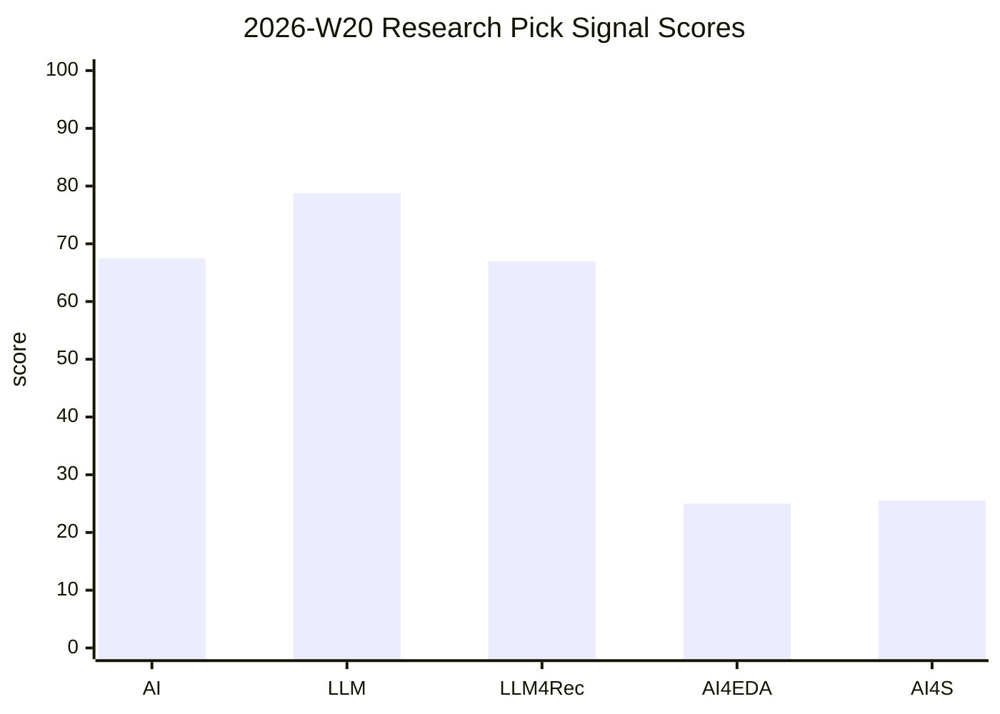

# Weekly Research Digest 2026-W20

## Summary

This digest captures one high-signal weekly item for each track: AI, LLM, LLM4Rec, AI4EDA analog circuit design, and AI4S protein/biology.

## Picks

| Track | Pick | Source | Date | Score | Short Core |
| --- | --- | --- | --- | ---: | --- |
| AI | [crewAIInc/crewAI](https://github.com/crewAIInc/crewAI) | github | 2026-05-16T10:13:59Z | 67.5 | Framework for orchestrating role-playing, autonomous AI agents. |
| LLM | [NVIDIA/TensorRT-LLM](https://github.com/NVIDIA/TensorRT-LLM) | github | 2026-05-16T11:40:29Z | 78.7 | TensorRT LLM provides users with an easy-to-use Python API to define Large Language Models (LLMs) and supports state-of-the-art optimizations to perform inference efficiently on NVIDIA GPUs. |
| LLM4Rec | [gorse-io/gorse](https://github.com/gorse-io/gorse) | github | 2026-05-15T14:49:09Z | 66.97 | AI powered open source recommender system engine supports classical/LLM rankers and multimodal content via embedding |
| AI4EDA analog circuit design | [AnalogCoder: Analog Circuit Design via Training-Free Code Generation](https://www.semanticscholar.org/paper/bcfd6404ad1c913b915d1f7731d3bc69564d98e7) | semantic-scholar | 2024-05-23 | 25 | Analog circuit design is a significant task in modern chip technology, focusing on selecting component types, connectivity, and parameters to ensure circuit functionality. |
| AI4S protein/biology | [westlake-repl/Evolla](https://github.com/westlake-repl/Evolla) | github | 2026-04-13T03:14:01Z | 25.56 | Evolla: A frontier protein-language generative model designed to decode the molecular language of proteins. |

## Signal Chart

## Agent Memory

- **AI**: Inspect repo structure, README tasks, evaluation scripts, and issue/release patterns before borrowing mechanisms.
- **LLM**: Inspect repo structure, README tasks, evaluation scripts, and issue/release patterns before borrowing mechanisms.
- **LLM4Rec**: Inspect repo structure, README tasks, evaluation scripts, and issue/release patterns before borrowing mechanisms.
- **AI4EDA analog circuit design**: Extract problem framing, method components, evaluation axes, limitations, and candidate baselines; do not copy prose. This is a fallback pick because live sources did not return a domain-qualified fresh item.
- **AI4S protein/biology**: Inspect repo structure, README tasks, evaluation scripts, and issue/release patterns before borrowing mechanisms.

## Sources

- EXTRACTED: Abstracts and metadata come from arXiv, Semantic Scholar, GitHub, and configured fallback public links where available.
- EXTRACTED: Raw evidence and API errors are stored under `raw/weekly-research-digests/`.

## Counterpoints and Gaps

- AMBIGUOUS: API rate limits and search ranking can bias weekly picks toward repos or older fallback papers.
- INFERRED: Treat each pick as an inspiration lead for agent recall, not as a final survey or citation-quality literature review.

## Evidence Notes

- EXTRACTED: Abstracts and metadata come from public scholarly/project APIs where available.
- INFERRED: Signal scores combine source quality, topical match, recency/update signal, citations/stars when available, and reusable idea density.
- Do not treat this digest as exhaustive literature review; use it as a weekly inspiration and routing layer.

## Related

- [[weekly-research-digests]]
